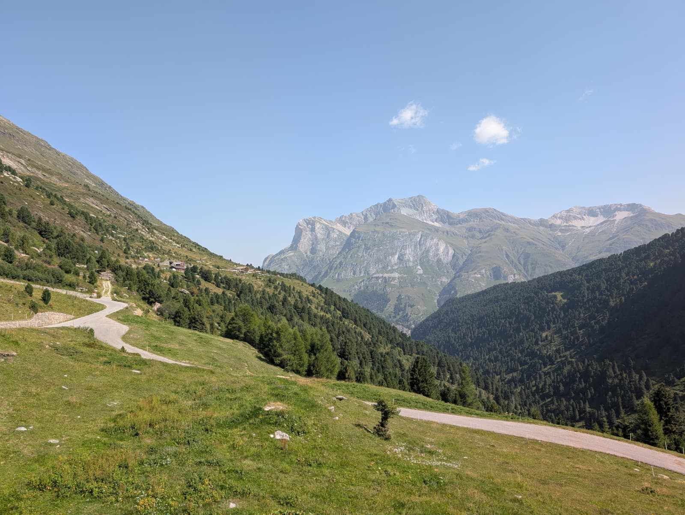

# Mountaineer Turbo Writeup

## Task Information
- **Author:** fantomet
- **Categories:** misc, osint 
- **Provided Material:** Image of a Mountain

## Challenge Description
I'm standing on top of this river next to a small town about 300m away, the mountain I'm looking at is 3060m tall and is approximately 3700m away. Can you find out which town I'm next to? Flag: NNS{name_of_town}

## Solution

The presented solution to the challenge is a bit unorthodox, but since Blorptopia said: "Submit that lolol," it will be submitted!

Furthermore, the solution is not reproducible, since it requires a time machine. You'll see why in a second.

To solve the challenge, you need to travel to Switzerland, taking the car from Chur past Andeer and Ausserferrera to a place called "Valle di Lei" approximately two weeks before the CTF. There, you will park on the Swiss side of the lake and cross the dam and into Italy.

After a few minutes, you will reach a restaurant called "Baita del Capriolo" where you will sit down and try to order something. There is, however, no menu! Instead, the waiter will come by with a selection of plates with different starters on them. You may choose any plate that looks appetizing to you. You will also be provided with a bottle of water and wine, for which you will pay for just what you drink. Afterwards, a main dish will be served; usually, there is a choice between two different dishes. If you want a coffee or dessert, you shall go inside and order that. Upon paying, you will be offered some limoncello, which you will say yes to because it is delicious. Half in a food coma, you shall stumble back toward where you parked your car and snap the following image.

This is a mountain called Piz Grisch, you think to yourself, "I should use this place as an OSINT CTF challenge," which you do for a CTF of your student organization. An image of a chapel at the lake, with the challenge "find the lake". Surely this is the most unique location to use for a CTF, right? If we compare this image to our challenge, we can see that the pictures were taken from opposite sides! Take five minutes to take in the absurdity of the situation.

Now, the most crucial step follows. This step can be used for other challenges, too, and will always solve them! The magic step is: Realize that, in the meantime, a teammate solved the challenge.

The picture was obviously taken in Ausserferrera.

## Flag / Final Answer

NNS{Ausserferrera}
